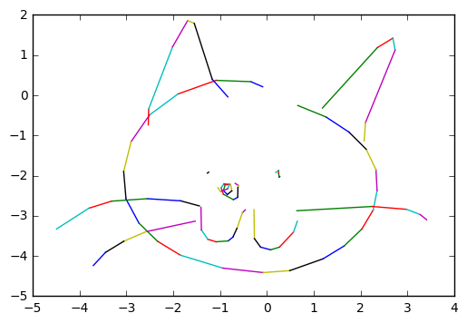

# SketchRNN

An implementation of SketchRNN use Pytorch

- use Jupyter notebook for learning purpose
- training on [The Quick, Draw! Dataset](https://github.com/googlecreativelab/quickdraw-dataset)
- contain cats pre-trained weights

## Reference

- [magenta/models/sketch_rnn](https://github.com/tensorflow/magenta/tree/master/magenta/models/sketch_rnn)
- [alexis-jacq/Pytorch-Sketch-RNN](https://github.com/alexis-jacq/Pytorch-Sketch-RNN)

